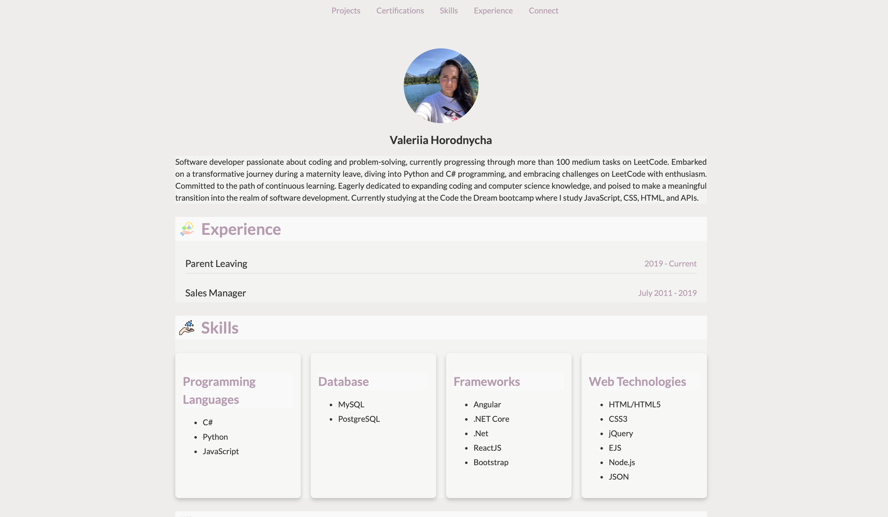
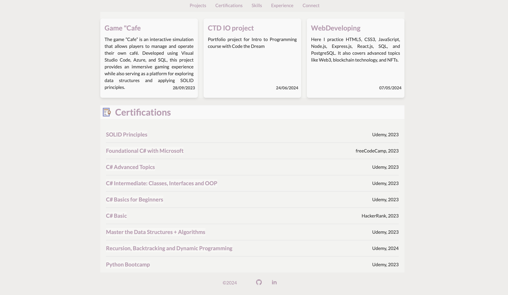

# valeriia-horodnycha
# Valeriia Horodnycha's Portfolio

Welcome to my portfolio! This repository showcases my work, including web projects, contact forms, and other programming endeavors. Below is an overview of the project components and setup instructions.

## Project Overview

This project includes:
- A contact form using EmailJS for sending emails.
- Various web development features including styling, responsive design, and client-side validation.
- Integration with external APIs for enhanced functionality.

## Features

- **Contact Form**: A form to send messages directly to your email using EmailJS.
- **Responsive Design**: Optimized for various devices using CSS media queries.
- **Client-Side Validation**: Ensures user input is validated before form submission.
- **Dynamic Content**: Utilizes APIs to fetch and display content.

## Setup Instructions

### Prerequisites

1. **EmailJS Account**:
   - Sign up for an EmailJS account at [EmailJS](https://www.emailjs.com/).
   - Create a service and a template in your EmailJS dashboard.
   - Note your `User ID`, `Service ID`, and `Template ID`.

### File Structure

- `index.html`: Main HTML file with embedded JavaScript and EmailJS configuration.
- `connect_me.css`: CSS file for styling the contact form and other elements.
- `media_q.css`: CSS file for responsive design.
- `js/index.js`: JavaScript file for handling form submission and interaction.

### EmailJS Integration

1. **Update EmailJS Configuration**:
   - Replace `YOUR_PUBLIC_KEY` in the script tag with your EmailJS public key.
   - Replace `'service_thb7aim'` with your EmailJS service ID.
   - Replace `'template_on5vqul'` with your EmailJS template ID.

   ```html
   <script type="text/javascript">
       (function() {
           emailjs.init("YOUR_PUBLIC_KEY"); // Replace with your EmailJS User ID
       })();
   </script>


Valeriia Horodnycha




